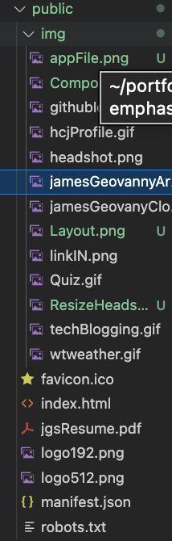

# React Portfolio 
  

  GITHUB: https://github.com/JimmySolis/portfolioWithReact
  APP: https://jimmysolis.github.io/portfolioWithReact/
  ## Description
  In this project I have remade my portfolio but with the use of react.

  ## Table of Contents 
  - [Installation](#installation)
  - [Usage](#usage)

  ## Installation
  There is no need to install anything. Just visit the link provided to the website.

  ## Usage
  To use the website just toggel through the different sections in the profile and see all the things available.

  ## Questions
  Here is my email for questions:  jimmysolis14@gmail.com
   
  If you would like to look me up in github, here is my username: JimmySolis
   
  Follow these instructions to contact me:  
  Please email me with questions. I will get back to you in one to two business days.

  ### How it Works:

  #### 1) React automatically bundles my code. Therefore, this layout has all the files and folders that make up my app.   
  

  #### 2) In the public folder I store all my images that I use throughout the app. As well as my resume pdf.
  

  #### 3) In these files I have the rendering of JSX that is inputed as a div with the id = root. All my dependency are impoted here as well giving me the chance to utilize throughout my app. 
  

  #### 4) Here are the core componets that work as sectionals for my app.
  

  #### 5) Finally here I have the actual content that goes in each page. Sectioning out like this help alot. Making the app very quick.
  
     
